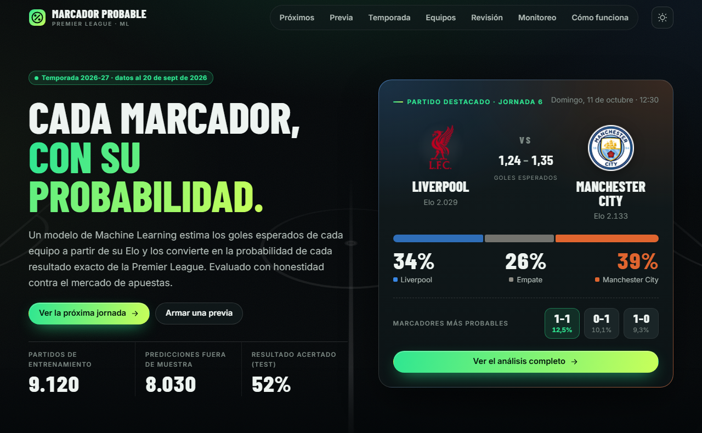
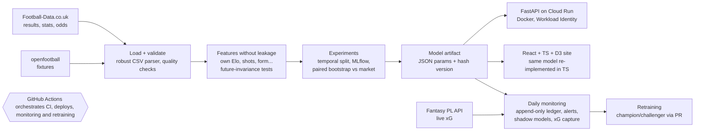
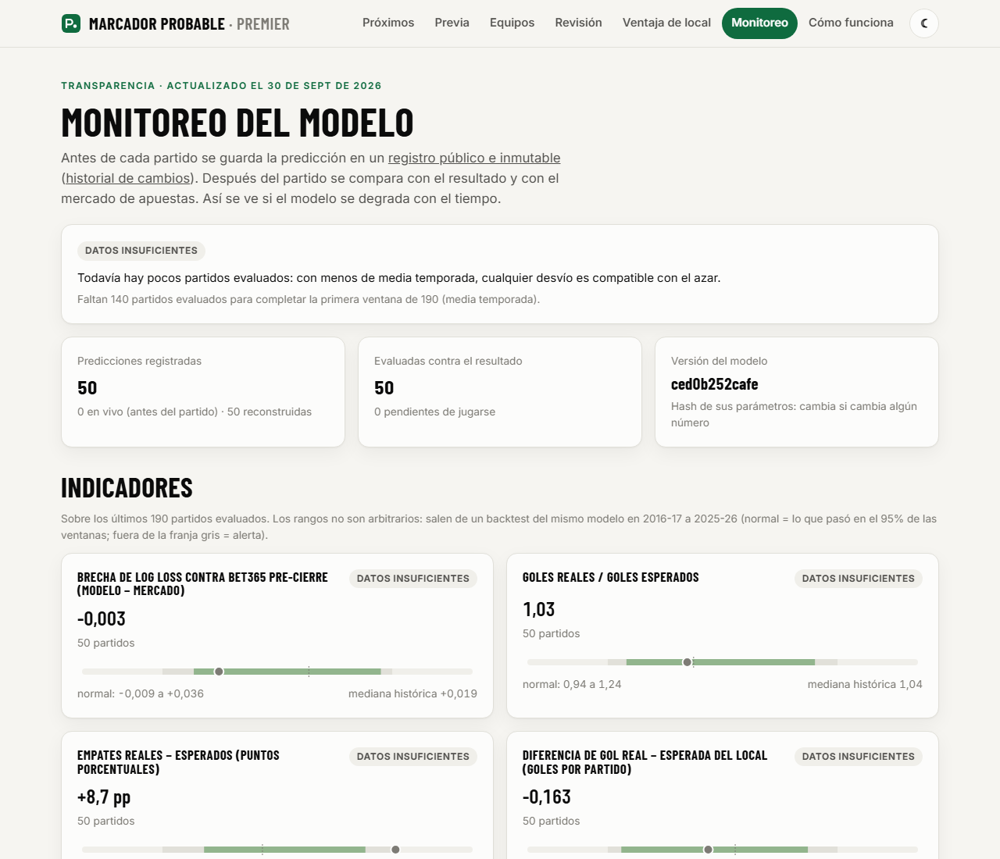

# Marcador Probable · Premier League match predictor

**An end-to-end, honestly evaluated football forecasting system:** it predicts the probability of every exact score of a
Premier League match (and from it home / draw / away), serves it through an API and a live website, logs every
prediction before kick-off in a tamper-evident ledger, and tests every improvement with pre-registered experiments.

**[Live site](https://ignaciogil23.github.io/futbol-predict/)** (Spanish UI) · **[Model card](docs/model_card.md)** ·
[Versión en español](README.es.md)



## Results in 30 seconds

| Question | Answer |
|---|---|
| **Does it beat the betting market?** | **No.** On the untouched test seasons (2023-24 to 2025-26, 1,140 matches) log loss is **0.988** vs **0.966** for Bet365 pre-closing odds and **0.944** for Pinnacle closing; the gap to Bet365 is +0.022 (95% CI 0.013 to 0.031). It is well calibrated (ECE 0.022). |
| **Is it competitive with published work?** | **Yes.** On the exact 3,300 matches of Ley, Van de Wiele & Van Eetvelde (2019, *Statistical Modelling*), RPS **0.1942** vs **0.1953** for the best of their 10 models (difference within our CI; protocol differences documented). |
| **What actually improves it?** | **Shots.** Adding recent shots and shots on target helps in the Premier League in 11 of 11 seasons (−0.004 to −0.005 log loss) and **replicates in Spain, Italy, Germany and France** (15,583 matches, −0.0049, CI [−0.0063, −0.0035]). It sits right at the pre-registered promotion margin, so it is being logged in parallel for a final decision in July 2027. |
| **What does not?** | Form, table, rest, head-to-head, Dixon-Coles, a bivariate Poisson, XGBoost (even trained on 5 leagues), starting line-ups, a recent home-advantage fix and squad market values: each was tested and documented. |
| **What can a fan ask it?** | **How the season ends.** 10,000 simulations of the remaining fixtures (Elo updated inside each run) give title, top-4 and relegation odds. Backtested on 2015-26 against a simulator that ignores team strength: 45% lower Brier for the top 4 before matchday 1, and well calibrated. It still gave Leicester 0% in 2015-16. |
| **Where is the gap to the market?** | Not in the averages but in match-level information: half of the gap comes from the 14% of matches where model and market disagree by 10+ points, and matchdays 1-5 double it (transfers the ratings have not absorbed yet). |

## Architecture



## How the model works

1. **Own Elo rating** updated match by match over the Premier League and Championship, with a goal-difference factor
   (Hvattum & Arntzen 2010), tuned only on training seasons.
2. **Two Poisson regressions** (home goals, away goals) on the Elo difference give the expected goals of each side;
   their product gives the probability of every score, and summing cells gives home / draw / away.
3. **Selection by evidence, not by complexity:** frequencies, an Elo logit, Dixon-Coles, the Poisson GLM and XGBoost were
   statistically indistinguishable in validation, so the simplest one won.

## Engineering decisions worth a look

* **Leakage is tested, not assumed.** Every feature for day *D* uses only matches before *D*. Tests blank all results
  from *D* on and require features for *D* to stay identical. They caught a real leak (a promoted team's starting Elo
  depended on later results).
* **Evaluation that cannot be gamed.** Temporal split with a test set used once; log loss as the primary metric; the
  market (Shin de-margining) as the benchmark; paired bootstrap confidence intervals; a fixed promotion rule
  (≥ 0.005 log loss and CI below 0).
* **Pre-registration.** Each new candidate has a protocol committed to git *before* its code and results
  (`docs/preregistro_*.md`), so the history proves the order. Other leagues serve as a test bed, so the Premier League
  data are not reused over and over.
* **Tamper-evident monitoring.** Predictions are appended to a ledger on a separate branch before kick-off and never
  rewritten; alert thresholds come from a 10-season backtest; retraining arrives as a pull request with sanity checks.
* **Portable, auditable artifact.** The model is JSON parameters (no pickle) with a hash version; the website runs the
  same model in TypeScript, verified against Python test vectors.
* **Security.** Cloud Run deploys via Workload Identity Federation (no long-lived keys); the runtime service account
  has no permissions; the API image excludes scipy and pyarrow.



## Experiments log

| Candidate | Where tested | Log loss vs baseline | Outcome |
|---|---|---|---|
| Shots + shots on target | Premier League 2015-26; 4 other leagues | −0.004 / −0.005; replicated: −0.0049 | In parallel logging until July 2027 |
| Fantasy xG (rolling) | Premier League 2023-26 | −0.0059 (fragile: CI touches 0 after multiplicity correction) | In parallel logging until July 2027 |
| Bivariate Poisson (Karlis & Ntzoufras 2003) | Premier League 2015-23 | exact-score log loss **worse** | Discarded (the draw excess did not persist after 2015) |
| Starting line-up strength | Premier League 2023-26 | +0.0006 | Discarded, and with it the injury-data collection |
| Recent home advantage | 4 leagues | −0.0001 | Fixes the home bias, no log-loss gain |
| Squad market value (Transfermarkt) | 4 leagues | −0.0008 (−0.0023 on matchdays 1-5) | Minimal; no live source |
| Pooled 5-league GLM / XGBoost | 4 leagues | +0.0001 / +0.0019 vs the shots model | Nothing beyond shots; XGBoost worse |

Full tables, confidence intervals and reasoning: [model card](docs/model_card.md).

## Tech stack

Python 3.11 · pandas · scikit-learn · XGBoost · MLflow · FastAPI · Docker · Google Cloud Run · GitHub Actions ·
React · TypeScript · Vite · D3 · pytest (175 tests)

## Reproduce

```bash
python -m venv venv && source venv/bin/activate        # Windows: venv\Scripts\activate
pip install -r requirements-dev.txt
python -m src.data.download && python -m src.data.load  # Football-Data (E0 + E1)
python -m src.features.build
python -m src.models.experiments --stage validation     # model selection (MLflow: mlflow.db)
python -m src.serving.production                        # models/production/model.json
python -m src.export.site --out web/public/data         # JSON for the website
pytest
uvicorn src.api.main:app --reload                       # API
cd web && npm install && npm run dev                    # website
```

Other experiments (other leagues, Fantasy, Transfermarkt) have their own entry points; each script documents its usage
in its docstring and each pre-registration names the command.

## Data and attribution

| Data | Source |
|---|---|
| Results, match statistics and odds (England, Spain, Italy, Germany, France) | [Football-Data.co.uk](https://www.football-data.co.uk/) |
| Fixtures | [openfootball/england](https://github.com/openfootball/england) (public domain) |
| ClubElo ratings (comparison only) | [Club-Football-Match-Data](https://github.com/xgabora/Club-Football-Match-Data) |
| Player xG and line-ups | [Fantasy Premier League](https://fantasy.premierleague.com/) API and the [vaastav/Fantasy-Premier-League](https://github.com/vaastav/Fantasy-Premier-League) archive |
| Squad market values | [dcaribou/transfermarkt-datasets](https://github.com/dcaribou/transfermarkt-datasets) |

Raw data are downloaded at build time and not versioned; only aggregated reports are published.
Educational project. **Not betting advice.**
